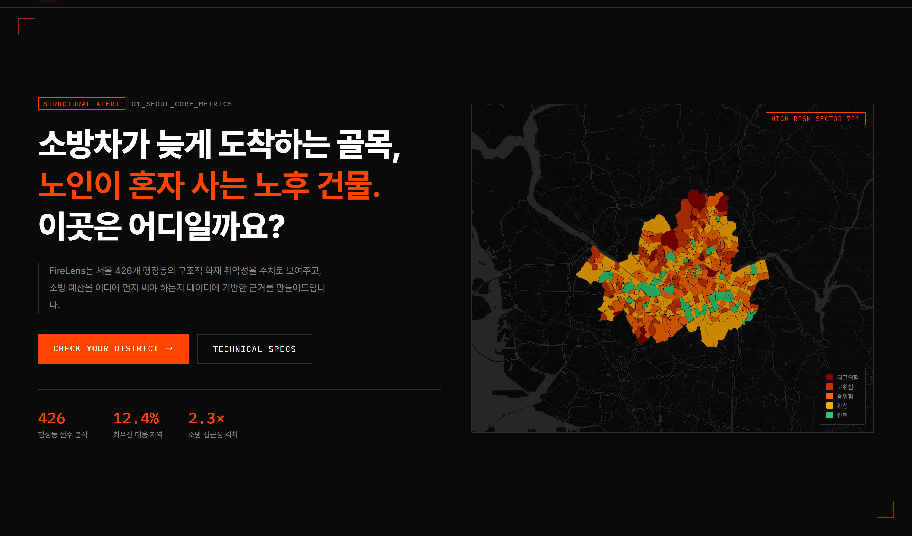
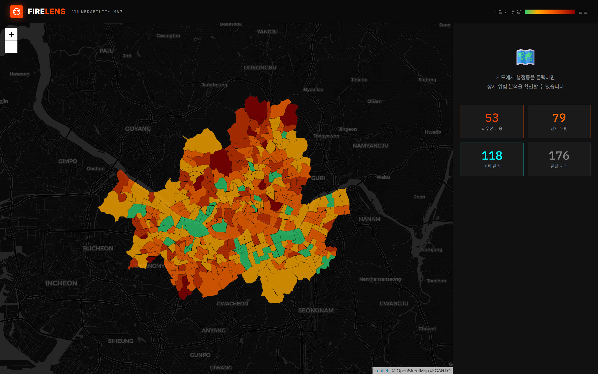
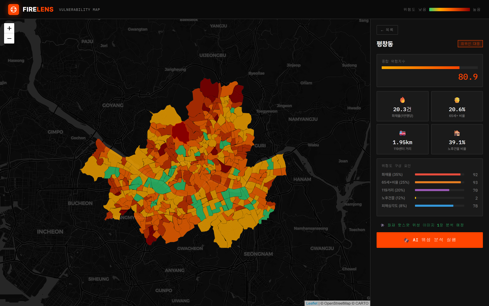
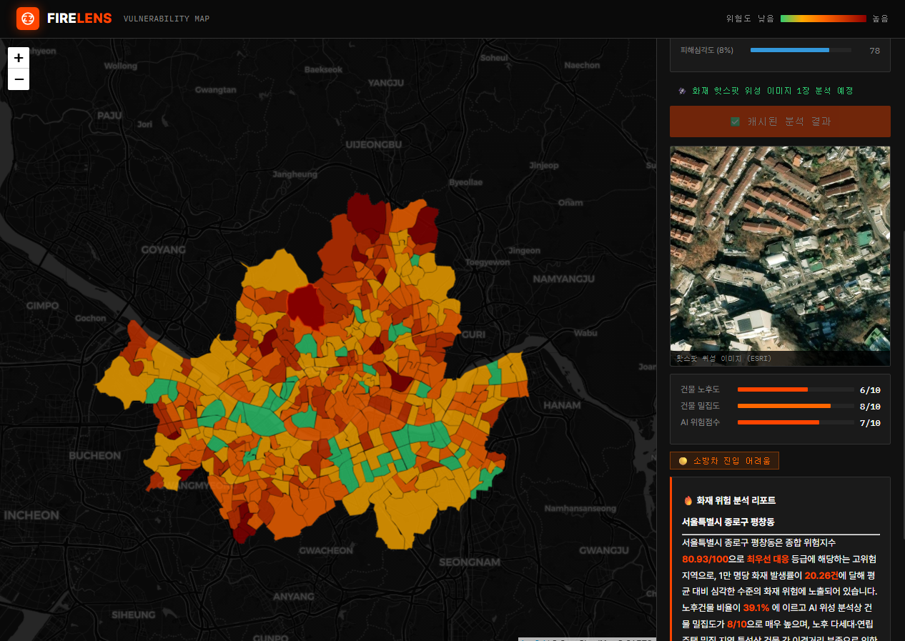
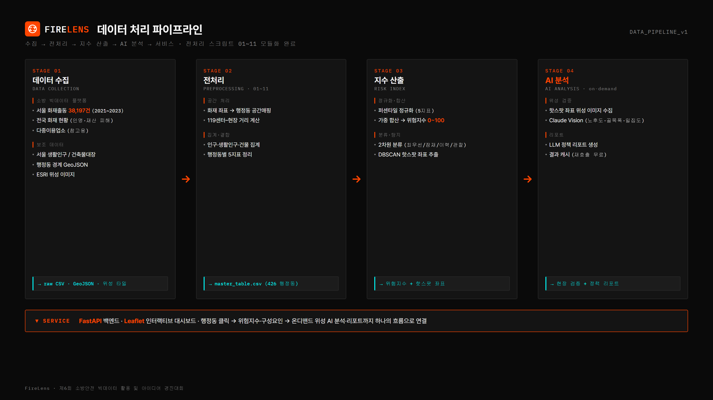

# FireLens 🔥

> 소방차가 늦게 도착하는 골목, 노인이 혼자 사는 노후 건물 — 이 두 조건이 겹치는 곳을 데이터로 찾아냅니다.

서울 426개 행정동의 **구조적 화재 취약성**을 복합 위험지수(0~100)로 수치화하고, 고위험 지역은 **AI 위성 분석**과 **LLM 정책 리포트**로 현장을 검증하는 웹 서비스.

제6회 소방안전 빅데이터 활용 및 아이디어 경진대회 · 서비스개발 부문 출품작.

---

## 실행 화면

### 랜딩 페이지


### 복합 위험지수 지도 — 426개 행정동


### 행정동 상세 진단


### AI 위성 분석 + LLM 정책 리포트


### 데이터 처리 파이프라인


---

## 핵심 기능

| 기능 | 설명 |
|------|------|
| **복합 위험지수 지도** | 화재 이력·고령 인구·119 접근성·건물 노후도·피해 심각도 5지표를 0~100 점수로 합산, 426개 행정동을 4단계로 분류 |
| **행정동 상세 진단** | 클릭 시 점수를 지표별 기여도로 분해 |
| **AI 위성 현장 검증** | 화재 반복 발생 좌표의 위성 사진을 Claude Vision이 골목 폭·노후도·밀집도로 평가 |
| **LLM 정책 리포트** | 위험지수 + 위성 분석을 묶어 소방 전문가 시각의 분석·권고 리포트 자동 생성 |

---

## 위험지수 산출식

```
risk_index_raw = 0.35·pct(화재율)
               + 0.25·pct(65세이상비율)
               + 0.20·pct(119거리)
               + 0.12·pct(노후건물비율)
               + 0.08·pct(화재당피해)
risk_index     = (raw − min) / (max − min) × 100
```

2차원 분류 — 과거 이력(`hist_score`) × 구조 취약성(`struct_score`) 두 축이 모두 상위 40%(≥60) → **최우선 대응**.
화재 반복 발생 중심 좌표는 DBSCAN(eps=150m, min_samples=2)으로 탐지 → 위성 AI 분석 대상.

---

## 활용 데이터

**소방안전 빅데이터 플랫폼**
- 서울시 화재출동 현황 (2021~2023, 38,197건)
- 전국 화재 현황 (2021~2023)
- 전국 다중이용업소 현황 (참고용)

**타 기관 공공데이터**
- 서울 생활인구 (서울열린데이터광장)
- 주민등록 인구통계 (행정안전부)
- 건축물대장 (국토교통부 건축HUB)
- 행정동 경계 GeoJSON (통계청 SGIS)
- 위성 이미지 (ESRI World Imagery)

---

## 기술 스택

- **백엔드** — FastAPI, pandas, geopandas
- **프론트** — Leaflet.js, 정적 HTML/CSS/JS
- **AI** — Claude Vision + LLM (Anthropic API)

---

## 실행

```bash
pip install -r requirements.txt

# Anthropic API 키 등록 (AI 분석 기능용)
echo "sk-ant-..." > data/keys/anthropic_api_key.txt

uvicorn app.main:app --reload --port 8000
```

- 랜딩: http://localhost:8000
- 대시보드: http://localhost:8000/dashboard.html

### API

| 메서드 | 경로 | 설명 |
|--------|------|------|
| GET | `/api/geojson` | 행정동 경계 + 위험지수 |
| GET | `/api/risk` | 위험지수 요약 |
| GET | `/api/dong/{adm_cd}` | 행정동 상세 |
| POST | `/api/analyze/{adm_cd}` | 위성 AI 분석 (캐시) |

---

## 디렉터리

```
app/                FastAPI 백엔드 + 정적 프론트
src/preprocess/     전처리 파이프라인 (01~11)
data/raw/           원천 데이터
data/processed/     전처리 결과 + 위험지수 + 시연 스크린샷
docs/               기획서·제출 자료
tools/              시연 자료 재생성 유틸
```

### 데이터 파이프라인

수집 → 전처리(`src/preprocess/01~11`) → 지수 산출(`08_risk_index.py`) → AI 분석(온디맨드)

```bash
python src/preprocess/run_all.py   # 01~06 일괄 실행
```
